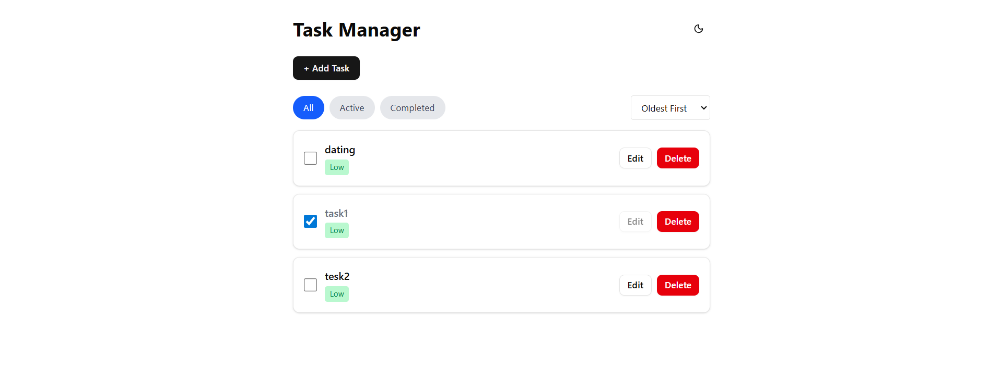
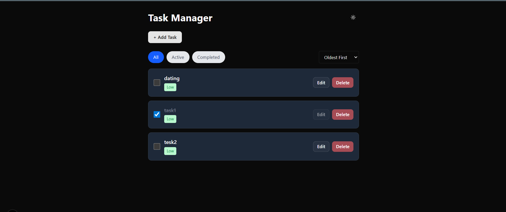

# 📝 Task Manager (Next.js + Zustand + Tailwind + shadcn)

A simple and responsive **Task Manager app** built with **Next.js 15, Zustand, Tailwind CSS, and shadcn/ui**.  
Users can add, edit, delete, and mark tasks as completed, set priorities, sort & filter tasks — with persistent storage via `localStorage`.  
Supports **light/dark mode** with `next-themes`.

---

## 🚀 Features

✅ Add tasks with **title, optional description, priority (Low/Medium/High)**  
✅ Edit tasks (only if not completed)  
✅ Delete tasks  
✅ Mark tasks as completed  
✅ Task priority labels with color & tooltips  
✅ Filters: All / Active / Completed  
✅ Sorting: Newest, Oldest, Priority  
✅ Data persistence via `localStorage`  
✅ Responsive UI (mobile-first, desktop-friendly)  
✅ Dark/Light mode toggle (auto-saves preference)  

---

## 🛠 Tech Stack

- [Next.js 15](https://nextjs.org/) – React framework  
- [Zustand](https://zustand-demo.pmnd.rs/) – global state management  
- [Tailwind CSS](https://tailwindcss.com/) – utility-first CSS  
- [shadcn/ui](https://ui.shadcn.com/) – accessible UI components  
- [next-themes](https://github.com/pacocoursey/next-themes) – theme management  

---

## 📸 Screenshots

### Light Mode  

### Dark Mode  

*(Add your own screenshots inside a `screenshots/` folder in the repo)*

---
 Clone the repository:
   bash
git clone https://github.com/TulaseeSubrrahmanyem/Task-manager-assignment/edit/main/README.md
